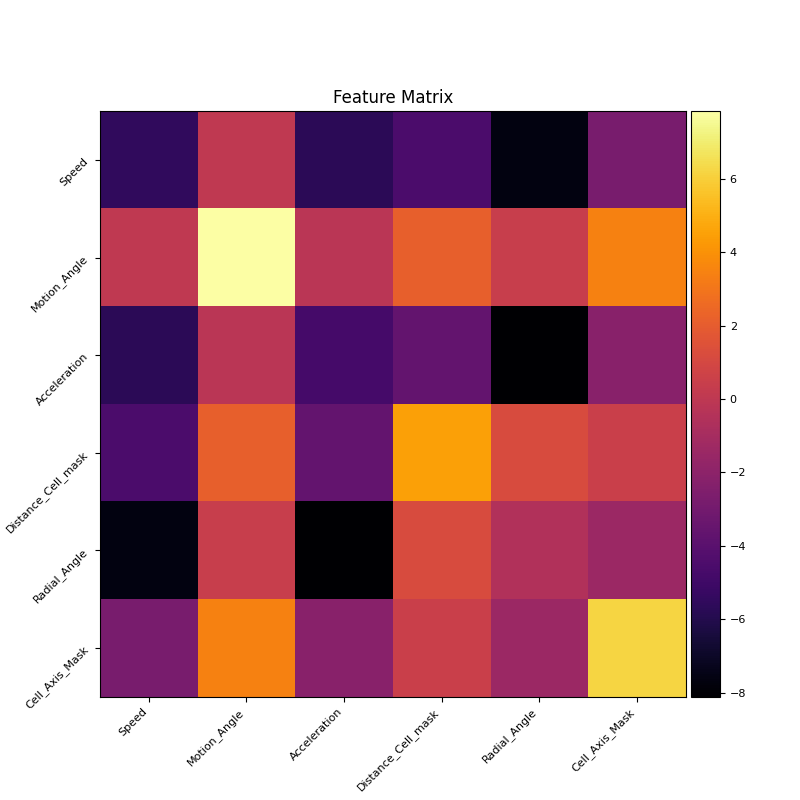
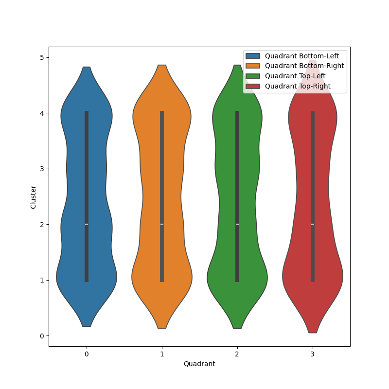
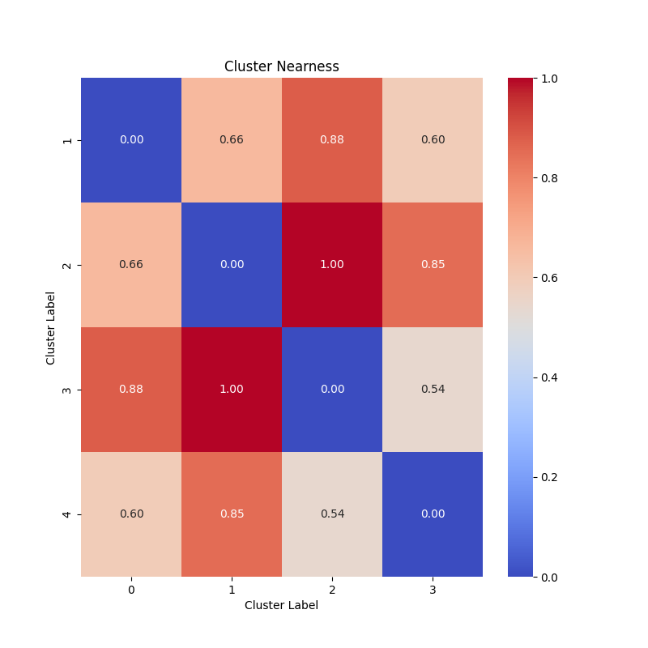
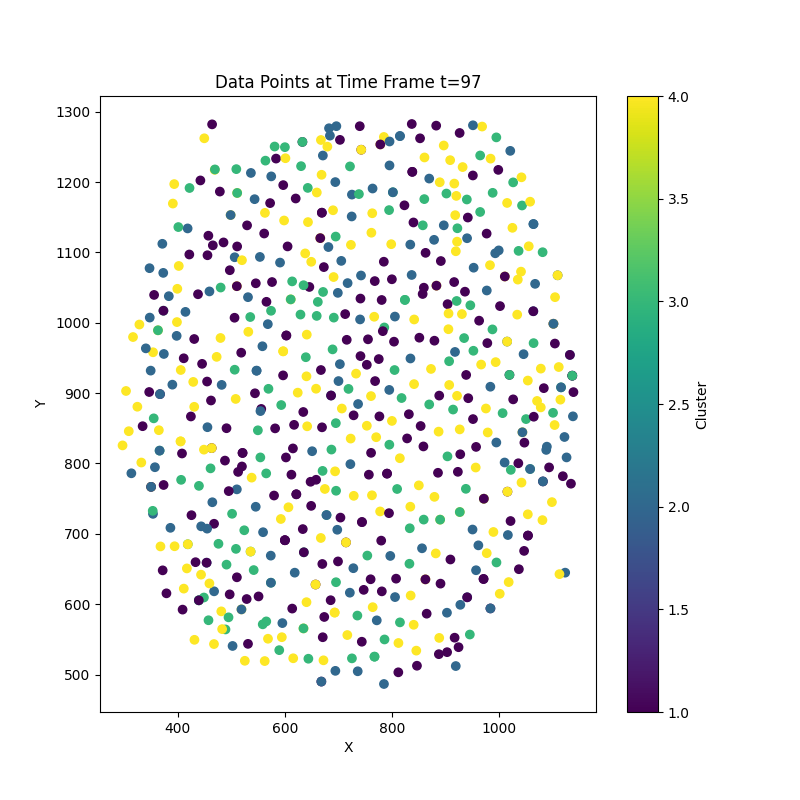
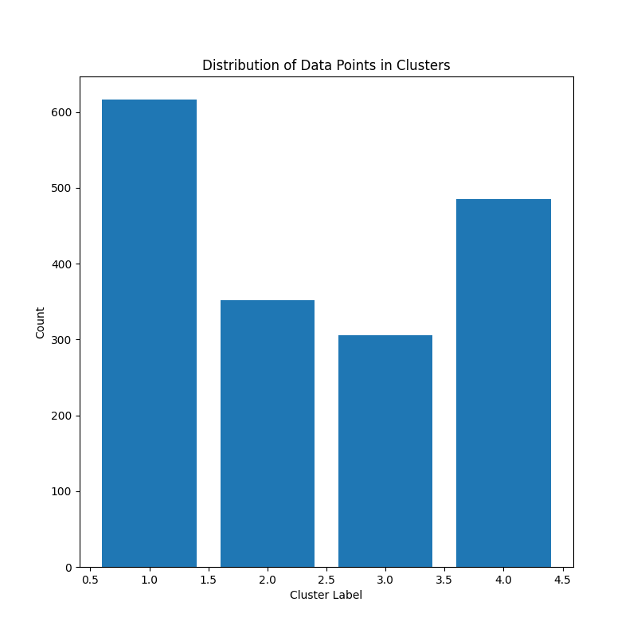

<!-- MathJax configuration -->

<!-- Your Markdown content -->

# Converting tracks to Feature Matrices

## Structure of Master XML

- AllSpots: <Spot ID (same as TrackMate Spot ID), name, Intensity, t,z,y,x,radius,tissue xyz, distance-cell-mask, track duration, radial angle, motion angle, speed, acceleration, eccentricity 
            components, surface area, cell axis mask, unique Napatrackmater ID, tracklet ID, generation ID>
- AllTracks: <Track TrackID (same as TrackMate Track ID), Track tzyx, Track speed, Track duration, Edge Spot source ID, Spot target ID, Directional rate of change, t,z,y,x,displacement>            

- Filtered track ids: list of selected track ids.

## Functional structure

- xml_content = parseXML(xml path)
- filtered_tracks = xml_content.find("Model").find("FilteredTracks").find("TrackID")
- spotobjects = xml_content.find("Model").find("AllSpots")
- tracks = xml_content.find("Model").find("AllTracks")

## Loops

- for frame in spotobjects.findall("SpotsinFrame"):
               _master_spot_computer(frame)
- _master_spot_computer:
         Most important dictionaries: unique_spot_properties[cell_id] = [cell_id, t,z,y,x,Intensity (mean and total), radius, Volume, distance cell to mask, unique track id, tracklet id, generation id, motion angle, speed, acceleration, radial angle, surface area, eccentricity components, cell axis mask]
- for track in tracks.findall("Track"):
               track_id = track.get(track_id_key)
               _master_track_computer(track, track_id)
- _master_track_computer:
         Most important dictionaries: track_mitosis_label[track_id] = [1, number_dividing] or [0,0] if the trjaectory belongs to a dividing cell or non-dividing cell
                                      unique_spot_centroid[t,z,y,x] = cell_id
                                      unique_track_centroid[t,z,y,x] = track_id
         Lists: AllTrackIds, Dividing TrackIDs, Non-Dividing TrackIDs          

## TrackMate Csvs

- dataframe object: spot_dataset = read(spot_csv_path)
- dataframe object: track_dataset = read(track_csv_path)
- dataframe object: edges_dataset = read(edges_csv_path)
Used in the Napari plugin for coloring the tracks and segmentation labels

# TrackVector

This is a class that converts the data from master xml file and spots, edges, tracks csv to feature matrices. A region of interest in TZYX can be entered and the tracks will only be extracted from the temporal voxel and it extracts the above mentioned dictionaries and lists and constructs new dictionaries:

### Unique Tracks

This dictionary contains for each TrackMate track id an array of tracklets, for a non dividing trajectory there is just one tracklet while for a dividing trajectory it is a union of tracklets of mother and daughter cells which are distinguished by thier unique tracklet id attached to them. The unique tracklet id contains the TrackMate track id and the generation and tracklet id of the corresponding tracklet.
- unique_tracks[track_id] = tracklets = array(unique napatrackmate ID, t, z, y, x)

### Unique Track Properties

Like the dictionary above this dictionary has tracklet properties 

- unique_track_properties[track_id] = tracklet_properties = array(t, unique napatrackmate ID, Shape Features, Dynamic Features, Intensity)

- shape features = [radius, volume in pixels, eccentricity components, surface area]
- dynamic deatures = [speed, motion angle, accceleration, distance, cell mask, radial angle, cell axis mask] 

## Tracklet Dictionaries

For each tracklet of each track we then construct the following dictionaries:

- unique_shape_properties_tracklet[unique_tracklet_id] = [t, z, y, x, radius, volume,...]
- unique_dynamic_properties_tracklet[unique_tracklet_id] = [t. speed, motion angle, acceleration,...]
- unique_dynamic_properties[track_id (TrackMate Track ID)] = {unique_tracklet_id: unique_dynamic_properties_tracklet}
- unique_shape_properties[track_id (TrackMate Track ID)] = {unique_tracklet_id: unique_shape_properties_tracklet}

These dictionaries ensure that we have full information of all the tracklets of a given TrackMate track ID. Then we construct the final data frame object that allows us to create the track matrices:

shape_dynamic_vectors = [] = [array(tracklet_id, t, z, y, x, shape properties (extracted from unique_shape_properties), dynamic properties (extracted from unique_dynamic_properties))]

Then we convert this to a pandas dataframe object and iterate over the tracklet_id to obtain for each tracklet ID the following Track Matrices:

\begin{bmatrix}
\text{time 1} & \text{time 2} & \text{time 3} & \cdots \\
\text{shape features} & \text{shape features} & \text{shape features} & \cdots \\
\text{dynamic features} & \text{dynamic features} & \text{dynamic features} & \cdots \\
\end{bmatrix}

This breaks down each tracklet into a (T, 11) dimensional matrix and we apply machine learning techniques on (K,T_k,11) dimensional tensor as explained in the following sections, K being the number of tracks.

# Machine Learning for cell fate quantification

## Unsupervised Learning

[unsupervised clustering](https://github.com/kapoorlab/MTVKW/blob/main/07_unsupervised_clustering.py)

[visualize clustering results](https://github.com/kapoorlab/MTVKW/blob/main/07_visualize_covaraince_matrices.ipynb)

Having breaken down tracks into tracklets and tracklets into feature matrix of shape (K,T_k,11) 11 being the shape and dynamic features computed, T_k being the timepoints for tracklet number K. For each tracklet we compute the covariance matrix which converts the matric (T_k,11) to (11,11) matrix. For K tracks this gives us (K,11,11) dimensional matrix. To ascertain which features had the most variance we compute an averaged covaraince matrix of shape (11,11) as shown here  

The plot is plotted in logscale and the diagonal elements show how much varaince is there in the tracks with respect to those features, for example in the plot above most of the variance is shown in surface area (brightest) and least by speed and acceleration (dimmest) showing that in the experiment the cells had varying surface areas but similar speed and acceleration. This also implies that while performing unsupervised clustering the features with the highest variance are the ones that matter the most. The non-diagonal elements show the relation of one feature vector with another. 

We also divide the XY space into quadrants and then compute the cluster labels belonging to each class, the notebook comes with an interactive time slider that can be changed to update this plot. For example for time point 97 we have this plot of the distribution of cluster labels across the quadrants. This plot can be used to judge if there is a spatial and temporal symmetry in the experiment hence showing influence of any external or internal forces during the course of the experiment. 

Another plot we create shows cluster nearnees that shows a cumulative score of how far different clusters are from each other. This plot can be used to judge if certain cell type prefer to be around each other during the early, mid or later stages of development. 

We also have a plot that shows the spatial distribution of cluster points.

to get an idea of how cells are distributed in clusters we also create a histogram plot. 

For performing unsupervised clustering the (K,11,11) matrix is flattened to be of the shape (K, 121), we then use pdist from from scipy.spatial.distance. This method computes the pairwise distance between the observations in (K,121) matrix and by default uses cosine similarity as a the metric to do so. It returns a lower triangular pairwaise distance matrix. 

After this we use linkage from scipy.cluster.hierarchy to perform clustering using 'ward' method by default. It takes the pairwise distance matrix of the previous step and merges similar data points into clusters. 

After this we use fcluster to extract clusters based on criteria 'maxclust' and it gives us the cluster labels for each tracklet K. We then create a dataframe object containing this information and save it as a csv file result_dataframe = full_dataframe[["Track ID", "t", "z", "y", "x", "Cluster"]], the track id here is the unique tracklet id. 

## Supervised Learning

[supervised clustering](https://github.com/kapoorlab/MTVKW/blob/main/08_supervised_clustering.py)

For supervised clustering we take the ground truth labels attached to the cells as labels for the tracks corresponding to those cells, the flattened covaraince matrix as explained in the previous step serves as the data for training and the ground truth labels as the labels for training either a K nearest neighbour algorithm or a random forest classifier. A trained model is returned by the function that can be used to predict the cell labels for unlabelled tracks. The model prediction returns a dataframe object result_dataframe = full_dataframe[["Track ID", "t", "z", "y", "x", "Cluster"]] and saves it as a csv file.
